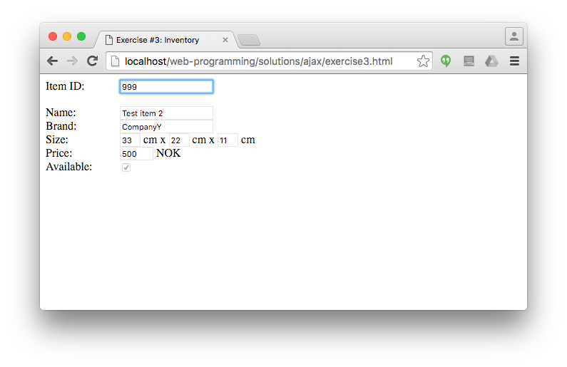
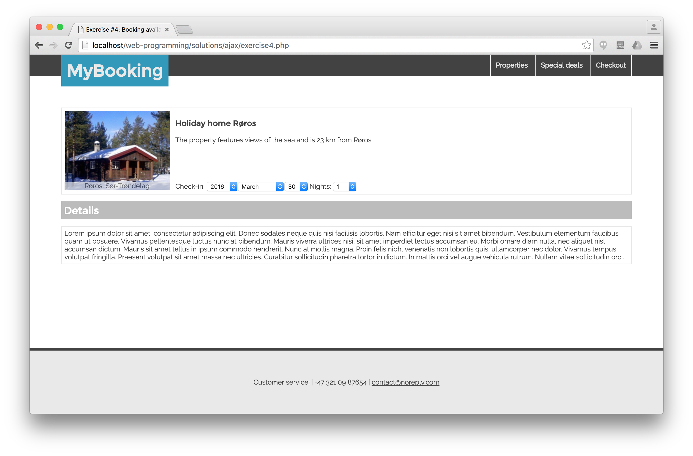
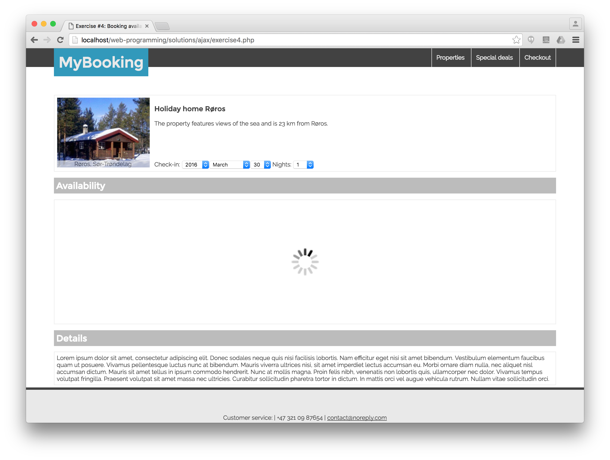
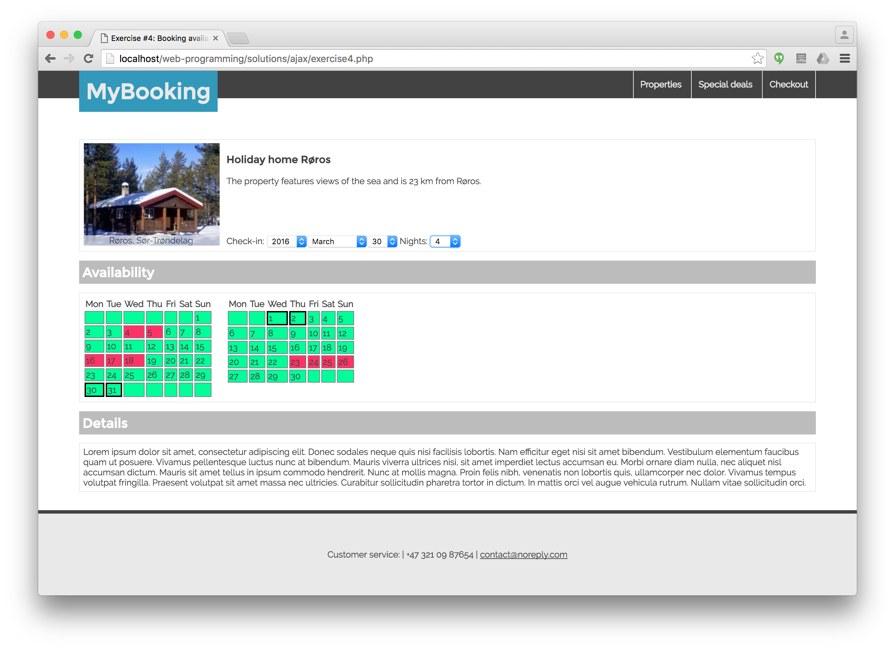

# AJAX exercises

## Exercise #1: Checking username

Check on the registration form whether the given username meets the requirements and is available. This has to be done using AJAX, i.e., without re-loading the page. Use GET for requesting data from the server.

  - The server-side script that performs the check is [check_username.php](check_username.php). Complete it such that it checks that
    * The username is minimum 3 characters long;
    * It contains only alphanumerical characters (letters or digits);
    * It has not been used before (for now a static array contains the used usernames).
  - The check has to be performed each time the username field loses focus (the user tabs or clicks out from the field); edit [exercise1.html](exercise1.html) accordingly. Don't display any error message if the username field is empty.
  - The AJAX request and response handling goes to [exercise1.js](exercise1.js). If the response from check_username.php is anything but an empty string, it means there is an error. Write that error string to the span with id `username_status`.


## Exercise #2: Checking username

Change your solution to Exercise #1 such that the data from the server is requested using POST.


## Exercise #3: Inventory

Assume that there is an inventory database where each item has a 3-digit unique identifier (e.g., `021`, `987`, etc.). For know, this data is stored as an associative array in the php file.

  - Complete [invertory.php](invertory.php) such that an inventory item can be looked up based on its 3-digit identifier. Return the inventory record as a JSON object. For example `inventory.php?item_id=123` should return

```
{"name":"Test item","brand":"CompanyX","size_x":11,"size_y":22,"size_z":33,"price":1000,"available":false}
```

  - Complete [exercise3.js](exercise3.js) to parse the JSON response and display the values in the corresponding form fields.




## Exercise #4: Booking availability

Implement a feature on the "property page" of the booking site (from Assignment 3) that displays a table with the availability of a given property for the selected dates.

This exercise requires using a combination of HTML, CSS, PHP, MySQL, JS, and AJAX, and consists of the following files:
  - `exercise4.php` is the main file.
  - `exercise4.inc.php` contains PHP functions that are used in the main PHP file.
  - `exercise4.css` is the CSS file.
  - `exercise4.js` contains all JS code.
  - `exercise4.ajax.php` is responsible for generating the AJAX response.

The specific requirements are as follows:

  - The availability div should not be visible by default.
    * Set its initial visibility using JavaScript in the `init()` function.
  - Update the contents of the availability div each time the check-in date or the number of nights changes.
    * Assign the `checkAvailability()` JS function to the necessary events.
  - Make an AJAX call to `exercise4.ajax.php` with the dates as parameters in `checkAvailability()`.
  - Display a spinning circle (`images/loader.gif`) while waiting for the response. (Then, replace the spinning circle with the tables.)
  - Generate the full HTML table(s) with the availability in exercise4.ajax.php.
    * Display a single month if check-in and check-out are in the same month. Otherwise display two months next to each other. (See the `displayCalendar()` function in [calendar.inc.php](../php/basics/calendar.inc.php) from earlier PHP exercises.)
    * Load the availability of the given property from the bookings table (from Assignment 6).
        - You can find the [table structure here](../../solutions/ajax/bookings.sql).
        - Insert some records manually (or using the code you wrote for Assignment 6), so that you have some data for testing.
    * Color available days as green and unavailable days as red.
    * Add a solid distinctive border around the selected days (from check-in to check-out).
    * Add a 1s delay before returning results.
  - Bonus exercise: change the number of days in the day select list according to the number of days in a month using JS, when date or month changes.




