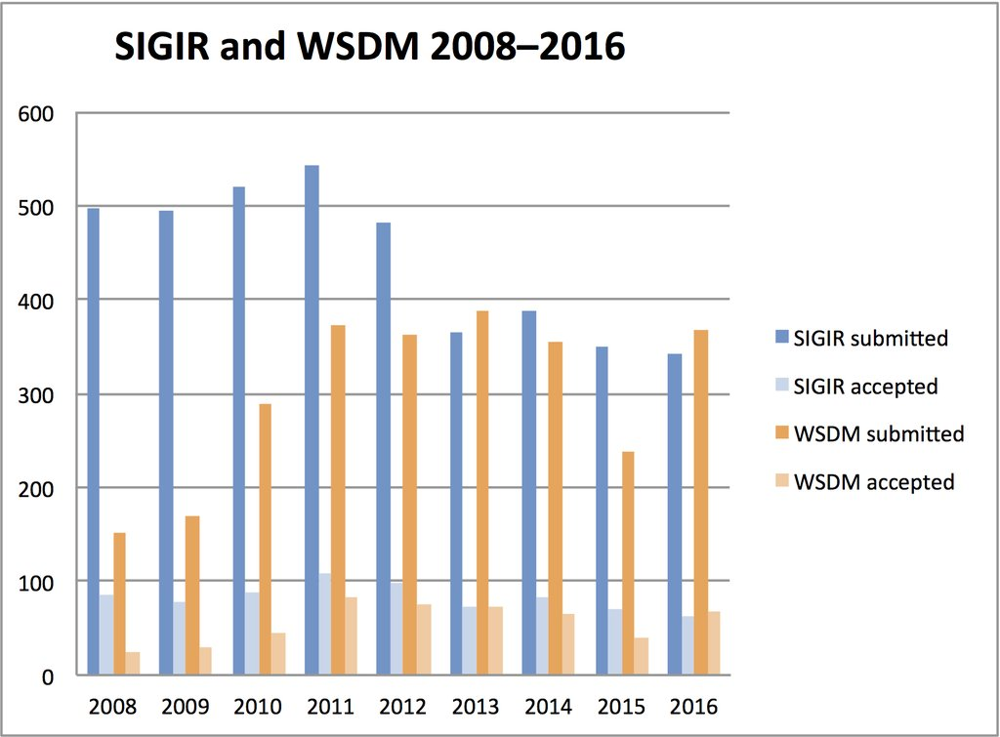

# WEB API exercises

## Exercise #1: Displaying hiking route

Create a map using the Google Maps API that displays a hiking route between a number of different locations. Use a terrain map. The [starter file](exercise1.html) initializes a map.

Hint: you will need to draw a polyline or polygon.

See the [W3C tutorial](http://www.w3schools.com/googleapi/google_maps_overlays.asp) or the [official Google Maps API documentation](https://developers.google.com/maps/documentation/javascript/) for help.

## Exercise #2: Map of properties

Create a map using the Google Maps API that displays all the properties from the booking table using markers. When the user clicks on a marker, show the details of that property (photo, location, and description) in an info window.

  - You will need to use PHP to query the properties from MySQL and generate the map. We can simply use `Properties.class.php` from before for that.
  - You may extend the properties table with latitude and longitude columns.

## Exercise #3: Plotting conference statistics

A certain professional organization runs a number of conferences. Our task is to create a webpage for them where users can plot historical statistics (number of submissions and acceptance rates) for conferences and compare them.

Specifically, the envisaged interface includes the following controls:
  - Conference selector (list of conferences with checkboxes)
  - Contribution selector (select list with the type of contributions: full papers, short papers, demonstrators)
  - Date selector: two select lists for specifying start and end years

A plot should then be generated, like this (just prettier):

  - Find a charting API for the task.
  - Figure out the best way to represent the data. (We probably want to use associative arrays in JavaScript.)
  - Implement the above functionality.
