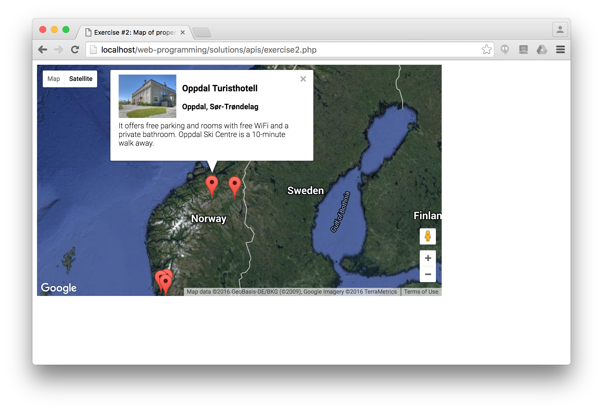
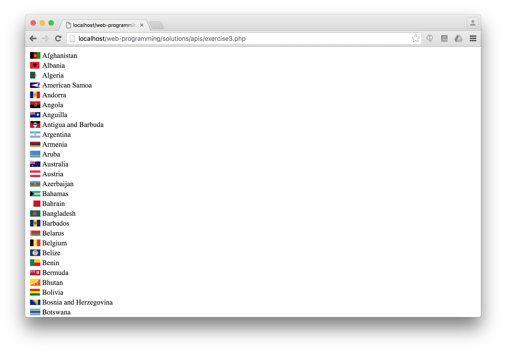
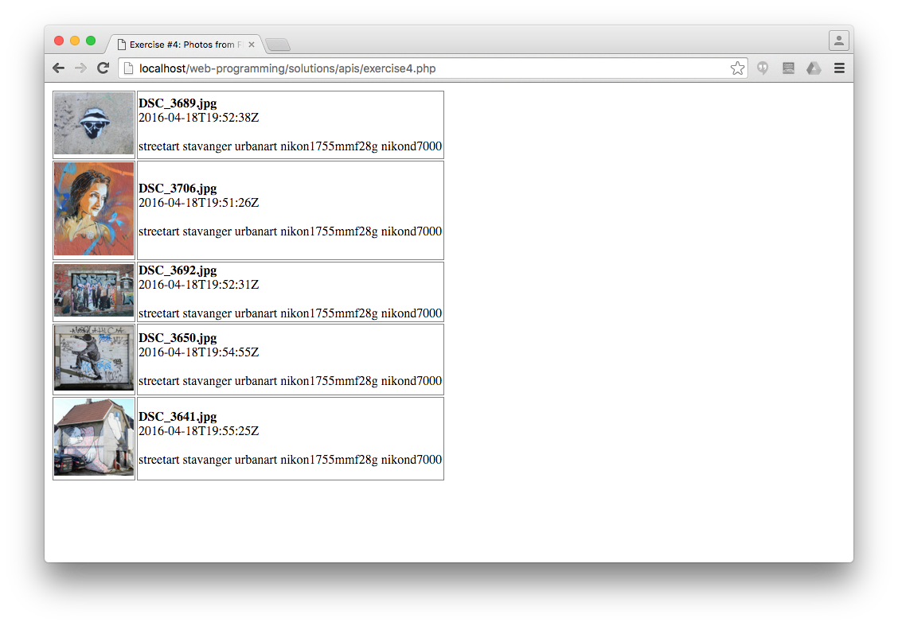
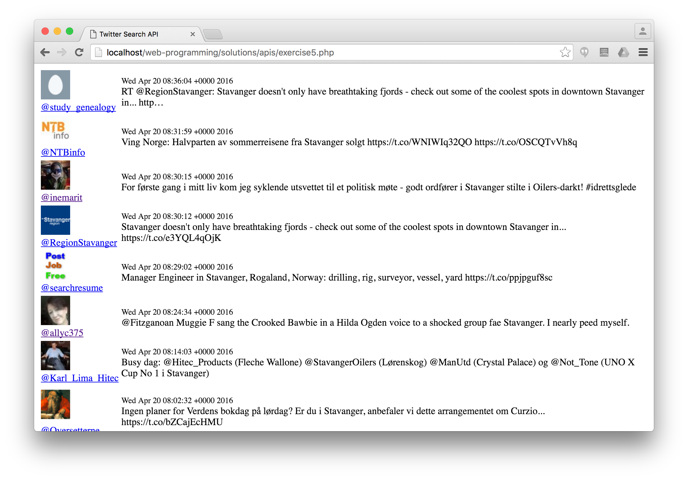

# WEB API exercises

## Exercise #1: Displaying hiking route

Create a map using the Google Maps API that displays a hiking route between a number of different locations. Use a terrain map. The [starter file](exercise1.html) initializes a map.

Hint: you will need to draw a polyline or polygon.

See the [W3C tutorial](http://www.w3schools.com/googleapi/google_maps_overlays.asp) or the [official Google Maps API documentation](https://developers.google.com/maps/documentation/javascript/) for help.

## Exercise #2: Map of properties

Create a map using the Google Maps API that displays all the properties from the booking table using markers. When the user clicks on a marker, show the details of that property (photo, location, and description) in an info window.

  - You will need to use PHP to query the properties from MySQL and generate the map. We can simply use `Properties.class.php` from before for that.
  - You may extend the properties table with latitude and longitude columns.

## Exercise #3: FIFA countries

Extract the list of FIFA countries with flag and country name from [this Wikipedia page](https://en.wikipedia.org/wiki/List_of_FIFA_country_codes) using PHP.

(Note: this exercise is about making HTTP requests from PHP using curl; there is no Web API involved here.)

  - First scrape the page using curl.
  - Then, extract the data into an array.
    * Hint: look for the lines starting with `<td>`. Best is to use a regular expression for extracting the values.
  - Finally, print the collected data as a table.

## Exercise #4: Photos from Flickr

Get 5 recent photos of Stavanger from [Flickr's public feed](https://www.flickr.com/services/feeds/docs/photos_public/) using PHP and cURL.
Display them in a table title, date, tags, and a link to the photo’s page on Flickr.

Note: set `nojasoncallback=1` for raw JSON response in the request URL (`http://api.flickr.../photos_public.gne?nojsoncallback=1&param1=value1...`).

## Exercise #4b: Photos from Flickr

Solve the same exercise using jQuery and JSONP.

## Exercise #5: Twitter search

Extend the twitter search example by displaying the user’s profile image and add link to her profile.

