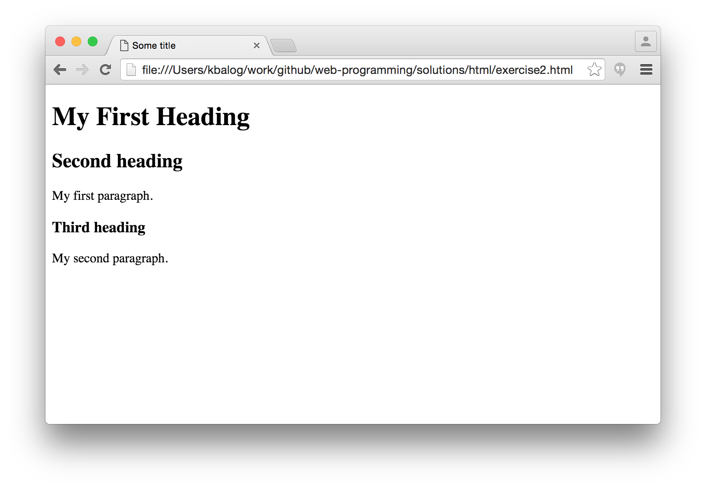

# HTML exercises

## Exercise #1: Hello world

Copy-paste the following snippet to a text editor and save it as exercise1.html.
Then open the file with any web browser (e.g., Firefox, Chrome, or Internet Explorer).

```html
<!DOCTYPE html>
<html>
<head>
	<title>Hi there</title>
</head>
<body>
	Hello world!
</body>
</html>
```

## Exercise #2: Headings and paragraphs

Create the following HTML page. You can use a text editor or the [w3schools try-it editor](http://www.w3schools.com/html/tryit.asp?filename=tryhtml_intro).

  - The headings should be `<h1>`, `<h2>`, and `<h3>` (don't forget the closing tags!)
  - The paragraph text should be inside `<p>..</p>`



## Exercise 3

## Exercise 4

## Exercise 5


