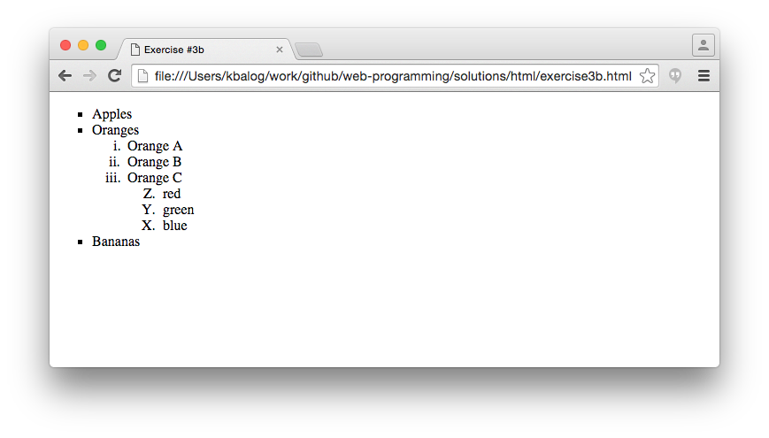

# HTML exercises

## Exercise #1: Hello world

Copy-paste the following snippet to a text editor and save it as exercise1.html.
Then open the file with any web browser (e.g., Firefox, Chrome, or Internet Explorer).

```html
<!DOCTYPE html>
<html>
<head>
    <title>Exercise #1</title>
</head>
<body>
	Hello world!
</body>
</html>
```


## Exercise #2: Headings and paragraphs

Create the following HTML page. You can use a text editor or the [w3schools try-it editor](http://www.w3schools.com/html/tryit.asp?filename=tryhtml_intro).

  - The headings should be `<h1>`, `<h2>`, and `<h3>` (don't forget the closing tags!)
  - The paragraph text should be inside `<p>..</p>`.


## Exercise #3: Lists

Create an ordered list nested inside an unordered list.

  - Use the tags `<ol>`, `<ul>`, `<li>`.


  

## Exercise #3b: Advanced lists

Building on the previous exercise, make the following changes:

  - Use squares as list markers (instead of bullets) for the unordered list.
  - Use roman lowercase numbers for numbering the nested ordered list. 
  - Add another nested list under "Orange C", with three items (red, green, blue), numbered with uppercase letters. The numbering should start with "Z" and go in descending order (Z, Y, X, ...).
  - See [this page](http://www.w3schools.com/html/html_lists.asp) for how to change list markers.
  - See [this page](http://www.w3schools.com/tags/tag_ol.asp) for reference on ordered lists.




## Exercise 4

## Exercise 5

## Exercise #6: Table of contents

Create a table of contents for the Exercises #1-#5.

  - 


