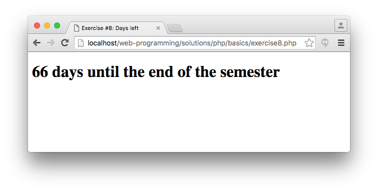
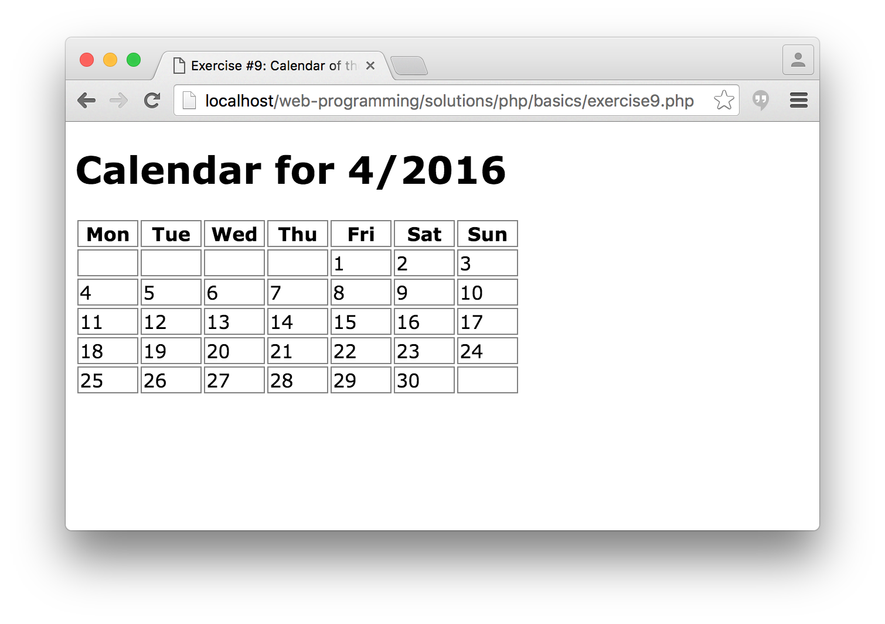
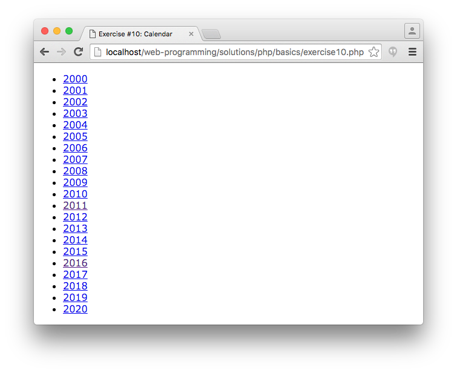
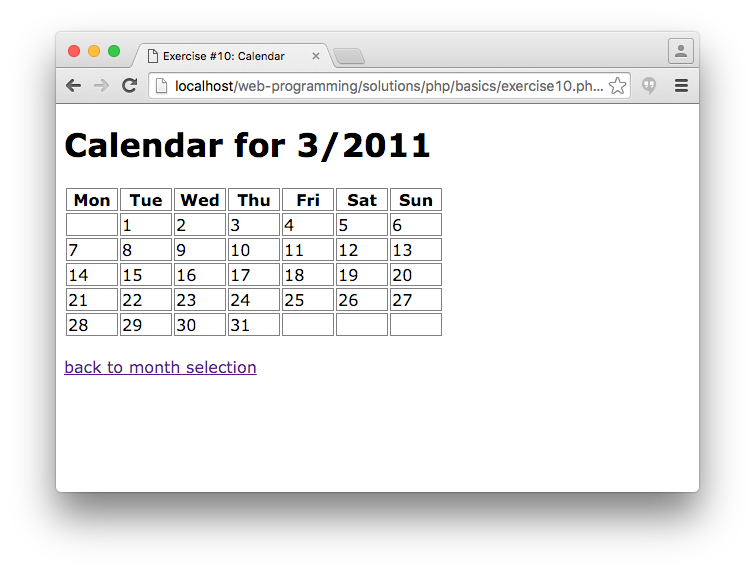
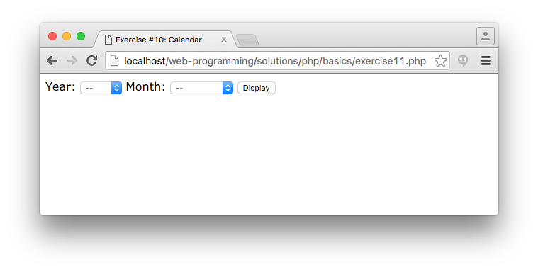
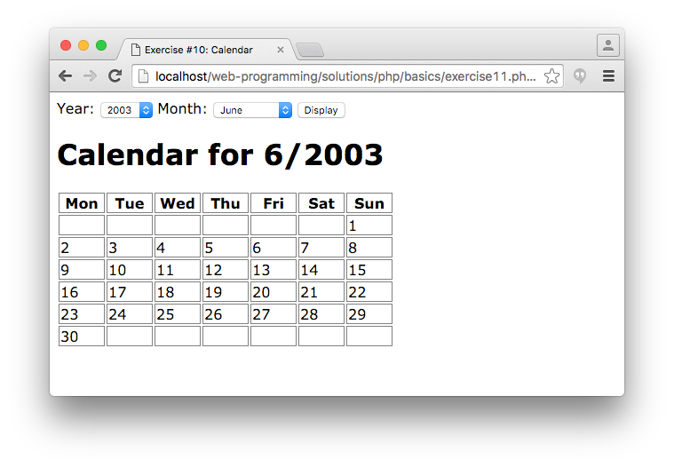
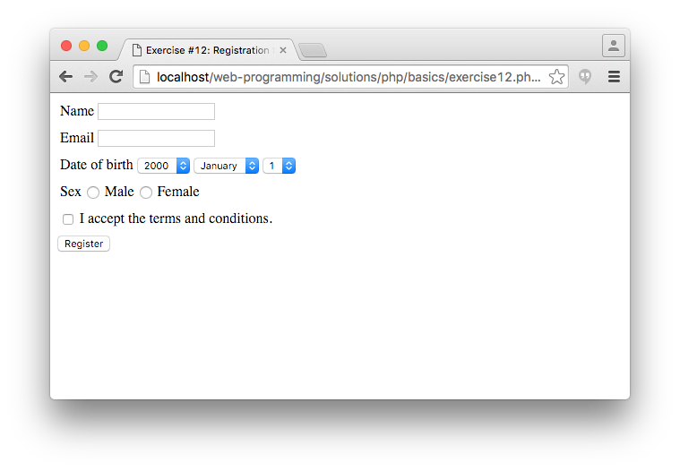
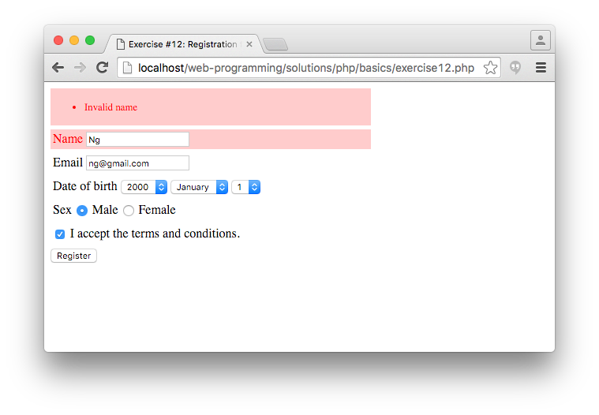
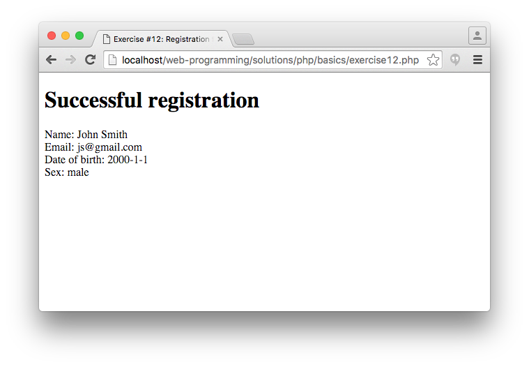

# PHP exercises, Part I. (basics)

## Exercise #0: Hello world

Get [exercise0.php](exercise0.php) running on your computer (localhost).


## Exercise #1: Summing numbers

Write a `sumMaxTwo($a, $b, $c)` function that takes three numbers as input and returns the sum of the two largest ones.  For example, `sumMaxTwo(1, 2, 3)` returns `5`.


## Exercise #2: Mixing cases

Write a `mixCase($str)` function that takes a string as input and returns a string where every odd letter is changed to uppercase.  For example, `mixCase("TeStStRiNg")` returns `"TeStStRiNg"`.

See the [PHP string functions reference](http://www.w3schools.com/php/php_ref_string.asp).


## Exercise #3: Password strength

Write a function `strength($password)` that takes a string password as input and returns the password's strength as an integer:

  - **0** means the input string was empty.
  - **2** means _medium_ password: at least 6 characters long AND contains both lower- and uppercase letters and at least one number.
  - **3** means _strong_ password: more than 8 characters long, contains both lower- and uppercase letters, numbers (more than one), and at least one non alphanumeric character.
  - **1** means _weak_ password: otherwise.


## Exercise #4: Computing mean and median

Given an array of integers as parameter, find and output the mean and the
median of the parameter array.

  - The mean is the average of the numbers.
  - The median can be found by sorting the numbers and picking the middle one (e.g., the median of {3, 3, 5, 9, 11} is 5). If there is an even number of numbers, then there is no single middle value; the median is then computed as the mean of the two middle values (the median of {1, 5, 7, 9} is (5 + 7) / 2 = 6).

For example,

```php
$numbers = array(1, 5, 7, 9);
meanAndMedian($numbers);
```

should output

```
mean =  5.5
median = 6
```


## Exercise #5: Arrays

Complete the two tasks in [exercise5.php](exercise5.php).


## Exercise #6: Calculator

Create a simple `Calculator` class with a constructor that takes two numbers as arguments.  Then, make methods for adding (`add()`), multiplying (`multiply()`), subtracting (`subtract()`), and dividing (`divide()`) the two numbers.

The class will be used as follows:
```php
$mycalc = new Calculator(12, 6);
echo $mycalc->add() . "<br>"; // Displays 18
echo $mycalc->multiply() . "<br>"; // Displays 72
echo $mycalc->subtract() . "<br>"; // Displays 6
echo $mycalc->divide() . "<br>"; // Displays 2
```


## Exercise #6b: Calculator

Extend the Calculator class with a constant `MYCONST` and write a static function `myconst()` that returns the value of that constant. Then, call this method to display the value.


## Exercise #7: Bank account

Create a BankAccount class in PHP (with the same functionality that we had [in the JavaScript part](../../js/basics)):

  - Constructor takes name and balance as parameters.
  - `deposit($amount)` deposits the given amount.
  - `withdraw($amount)` withdraws the given amount, if there is sufficient funds.
  - Log all transactions in a private `$_log` variable.
  - `print_log()` outputs the transaction log.


## Exercise #8: Days left

Make a page that displays the number of days left from the semester in a `<h1>` heading. Hint: you can use the built-in [DateTime class](http://php.net/manual/en/class.datetime.php).




## Exercise #9: Calendar of the month

Write a PHP function `displayCalendar($year, $month)` that displays the calendar in a table for a given year and month. Put the days Mon ... Sun in the a table header (that is, start the week with Monday, not Sunday!).

Hint: use the [date() function](http://php.net/manual/en/function.date.php) to find out the number of days in a month, day of the week, etc.




## Exercise #10: Calendar

Building on the previous exercise, make a PHP script that first displays the years from 2000 to 2020 as an unordered list with links.



Once the user selects a year, show it in `<h1>` and display the months from Jan to Dec as an unordered list with links. Provide a "back" link at the bottom of each page that takes the user back to year selection.


Once the user selects a month, display the calendar of that month, using the `displayCalendar($year, $month)` function from the previous exercise. Provide a "back" link at the bottom of each page that takes the user back to month selection (while remembering the year).




## Exercise #11: Calendar

Instead of using lists, display both the years and the months as select lists in a form. Display the calendar when the user presses the "Display" button. Keep the year and month selection always visible at the top of the page. The form should "remember" the selected year and month values.






## Exercise #12: Registration form

[This registration form](exercise12.php) contains name, email, date of birth, and sex fields. Additionally, there is a checkbox for accepting terms and conditions.

  * Initialize the date fields with values from PHP (with for loops).
  * When the user submits the form, check if all fields have been filled in and the values are valid. If there are errors, then display the form again, but remember the values that were already filled in. Also, list the errors at the top of the page and display the problematic fields with a light red background and with red text.
    - Name must be at least 3 characters long.
    - Email address must be valid; you can use the [filter_var() function](http://php.net/manual/en/filter.examples.validation.php) for validating email addresses.
    - Date must not be empty, must be valid (e.g., 2016-02-30 is invalid), and the person has to be minimum 5 years old.
    - Sex must not be empty.
    - Terms and conditions must be accepted.
  * If all input is valid, then display a confirmation page.

  

  

  
