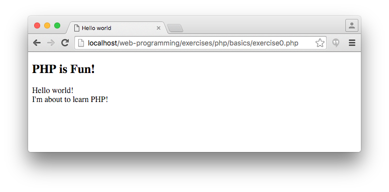

# PHP exercises, Part I. (basics)

## Exercise #0: Hello world

Get [exercise0.php](exercise0.php) running on your computer (localhost).




## Exercise #1: Summing numbers

Write a `sumMaxTwo($a, $b, $c)` function that takes three numbers as input and returns the sum of the two largest ones.  For example, `sumMaxTwo(1, 2, 3)` returns `5`.


## Exercise #2: Mixing cases

Write a `mixCase($str)` function that takes a string as input and returns a string where every odd letter is changed to uppercase.  For example, `mixCase("TeStStRiNg")` returns `"TeStStRiNg"`.

See the [PHP string functions reference](http://www.w3schools.com/php/php_ref_string.asp).


## Exercise #3: Password strength

Write a function `strength($password)` that takes a string password as input and returns the password's strength as an integer:

  - **0** means the input string was empty.
  - **2** means _medium_ password: at least 6 characters long AND contains both lower- and uppercase letters and at least one number.
  - **3** means _strong_ password: more than 8 characters long, contains both lower- and uppercase letters, numbers (more than one), and at least one non alphanumeric character.
  - **1** means _weak_ password: otherwise.


## Exercise #4: Computing mean and median

Given an array of integers as parameter, find and output the mean and the
median of the parameter array.

  - The mean is the average of the numbers.
  - The median can be found by sorting the numbers and picking the middle one (e.g., the median of {3, 3, 5, 9, 11} is 5). If there is an even number of numbers, then there is no single middle value; the median is then computed as the mean of the two middle values (the median of {1, 5, 7, 9} is (5 + 7) / 2 = 6).

For example,

```php
$numbers = array(1, 5, 7, 9);
meanAndMedian($numbers);
```

should output

```
mean =  5.5
median = 6
```


## Exercise #5: Arrays

Complete the two tasks in [exercise5.php](exercise5.php).


## Exercise #6: Objects

Create a BankAccount class in PHP:

  - Constructor takes name and balance as parameters.
  - `deposit($amount)` deposits the given amount.
  - `withdraw($amount)` withdraws the given amount, if there is sufficient funds.
  - Log all transactions in a private `$_log` variable.
  - `print_log()` outputs the transaction log.
