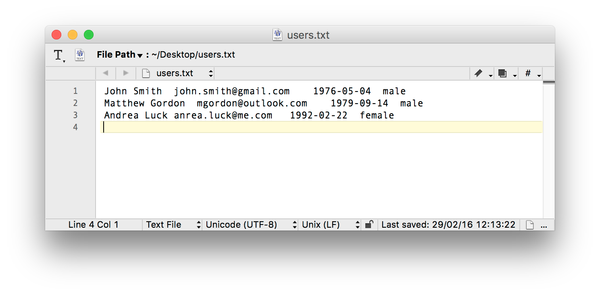
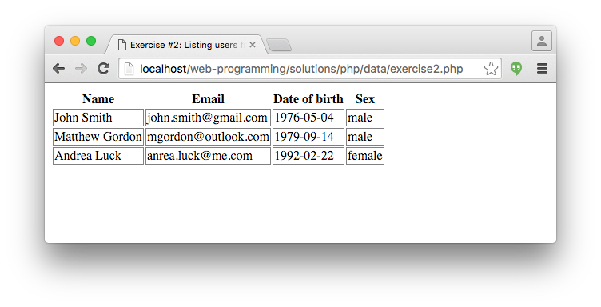
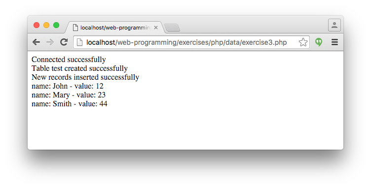
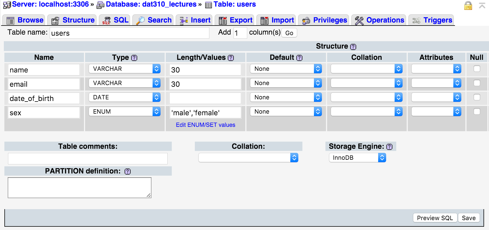
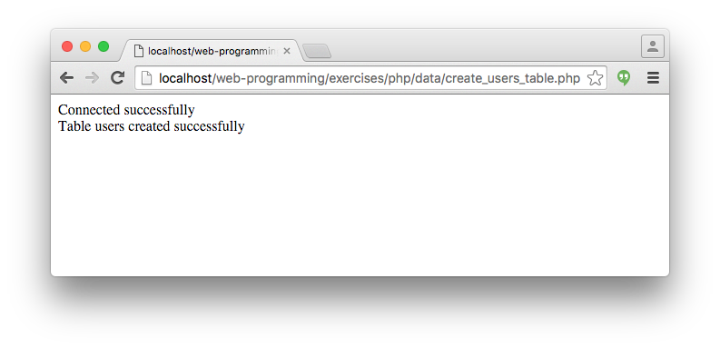

# PHP exercises, Part II. (data)

## Exercise #1: Saving users to file

Take [Exercise #12](../../../solutions/php/basics/exercise12.php) (registration form) from earlier as a starting point and save the submitted values to a text file in tab separated format.  The [starter file](exercise1.php) contains the fully functional solution of the earlier exercise, with the functions moved to a separate [reg.inc.php](reg.inc.php) file.

## Exercise #2: Listing users from file

Write a PHP script that loads all registered users from the textfile used in the previous exercise, and displays them in a table.

  - Hint: you can use the [explode() function](http://php.net/manual/en/function.explode.php) to split a string along tab characters.

## Exercise #3: MySQL test

  - Create a new database (e.g., `dat310_lectures`) on localhost.
  - Update [exercise3.php](exercise3.php) according to your database settings and run it on localhost.  
  - The script will (1) create a test table, (2) insert some data into that table, and then (3) query and display the contents of the table.

## Exercise #4: Saving users to MySQL table

The task is the same as Exercise #1, but this time make a `users` MySQL table and save the results to this table.

  - You can use PhpMyAdmin to create a table.

  - Alternatively, fill in your credentials in [create_users_table.php](create_users_table.php) and run it.

  - Update your MySQL settings and implement the `save_to_mysql()` function in [exercise4.php](exercise4.php).

## Exercise #5: Listing users from MySQL table

The task is the same as Exercise #2, but list the results from the `users` MySQL table. The [starter file](exercise5.php) is given.

## Exercise #6: Using prepared statements

In this exercise we update Exercises #4 and #5 to use prepared statements.

  - **Exercise #6a** Update [this code](exercise6a.php) to save users to MySQL using prepared statements
  - **Exercise #6b** Update [this code](exercise6b.php) to list users from MySQL using prepared statements

## Exercise #7: Login using cookies

  - Run exercise7.php on localhost and log in (see the source for usernames/passwords)
  - Check the cookie stored on your computer, using a browser or a browser plugin
    * E.g., [Cookie Inspector](https://chrome.google.com/webstore/detail/cookie-inspector/jgbbilmfbammlbbhmmgaagdkbkepnijn?hl=en) for Chrome
  - Do you see any problems with this solution?

## Exercise #8: Shopping cart

Implement the following methods in the ShoppingCart class:
  - `addProduct()` adds a product (product_id and qt as parameters)
  - `removeProduct()` Removes a product (product_id)
  - `listProducts()` Lists all products in the shopping cart

Store the contents of the shopping cart in the session. Hint: use an associative array that is indexed with the product_id and stores quantity as the value.

