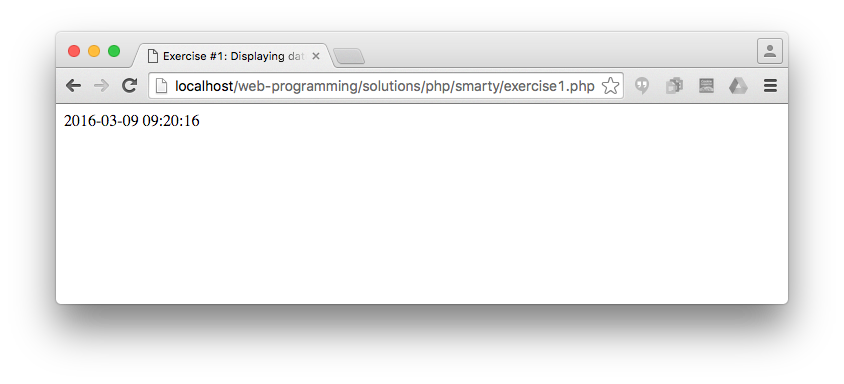
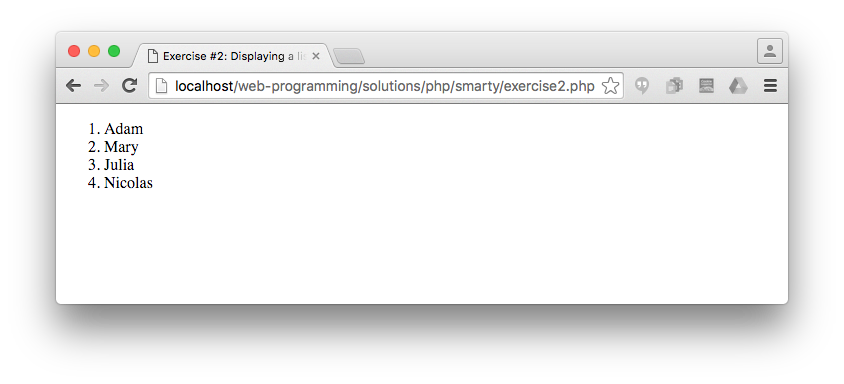
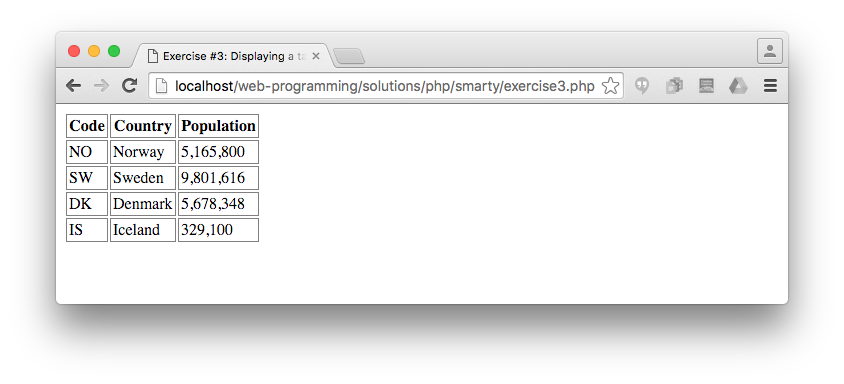
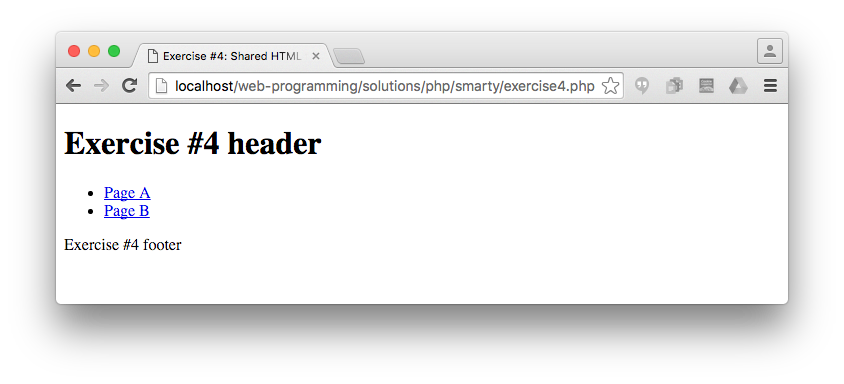
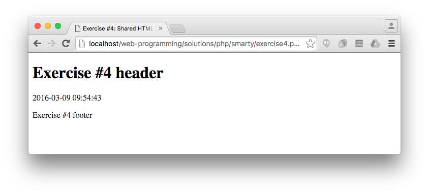
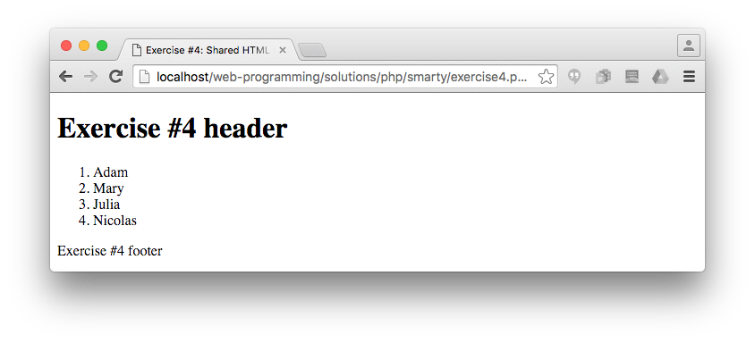

# PHP exercises, Part III. (Smarty)

## Exercise #0: Smarty setup

  - Install smarty and set up the folder structure as explained [here](../../../examples/php/smarty/README.md).
  - Update [smarty_init.inc.php](smarty_init.inc.php) according to your settings.

## Exercise #1: Displaying date

Complete [exercise1.php](exercise1.php) and [exercise1.tpl](smarty/templates/exercise1.tpl) such that the page displays the current date and time.

## Exercise #2: Displaying a list

Complete [exercise2.php](exercise2.php) and [exercise2.tpl](smarty/templates/exercise2.tpl) such that the page displays names in an ordered list.

## Exercise #3: Displaying a table

Complete [exercise3.php](exercise3.php) and [exercise3.tpl](smarty/templates/exercise3.tpl) such that the page displays countries in a table.

## Exercise #4: Shared HTML frame

Create a mini-site with three pages:
  - The "main" page displays links to Page A and Page B.
  - Page A displays the current date and time.
  - Page B displays a list (any list).

The three pages should share the same HTML frame (header and footer).

